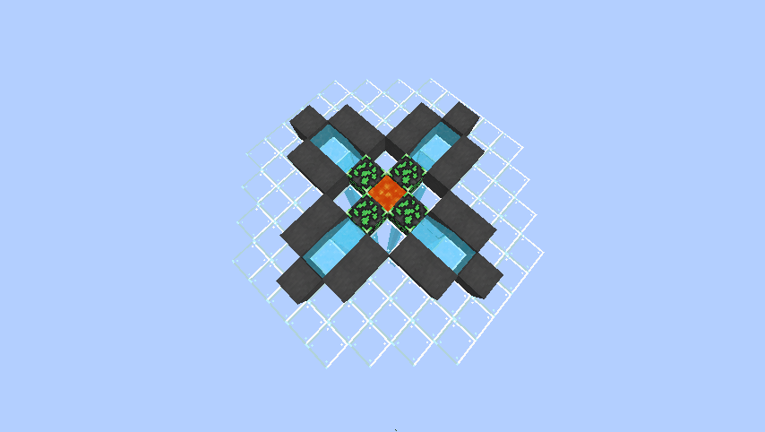

Get yourself some useful resource and build a 3X3X3 Dirt House!
Familiar with the control over your own island? Good, let's get things started by geathering your first piece of cobblestone!

## Cobble Generator
+ To Build a cobble gen , simply copy the design at the Shop or however you like.
  * 
+ An Advanced Version for 4 players mining together can be made with EASE!
  + 
+ Cobble Gen will generate random ores(Higher Tier Ores are Rarer! Obviously!!!)!

## Mob Spawner
+ Build a mob farm with Spawners that can be purchased from the shop
+ No mob will naturally spawn
  - Mob Spawner is currently the only way to farming mobs
